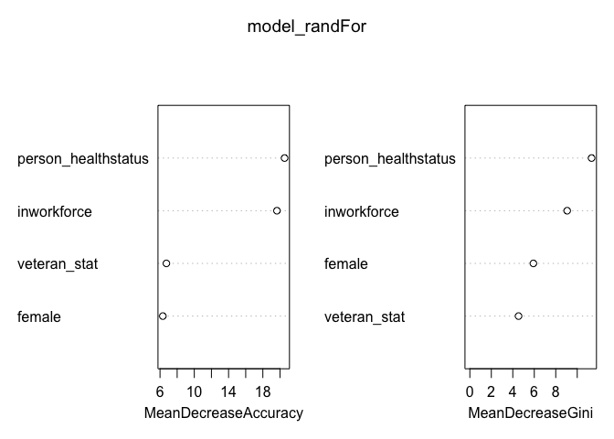

Lab7
================
Isabela Vieira
11/9/2020

Main question to answer: What factors make an adult more likely to have
health insurance?

``` r
#Load dataset:
load("~/Documents/College/Fall 2020/Econometrics/NHIS_2014/NHIS_2014.RData")
#Attach the new dataset from NHIS:
attach(data_use1)
```

Now, First, let’s define the population I want to use. I think it would
be nice to start with a population from a specific geography because the
healthcare marketplace varies according to state and healthcare
availability/pricing may influence a lot the likeability of a person
having insurance or not. The dataset doesn’t contain info about state,
so we will use the region to account for the impact of geographic
location. Since we are answering the question for adults, we will be
restricting the dataset to people above 25. As a foreigner, I was
unisured for the first 3 years in NY, just because I found the search
for healthcare too complicated and didn’t want to go throught the whole
process. Citzenship status is something that might affect a person’s
likeability to have insurance, especially if there are language
constraints, and that only affects a considerably small portion of the
population (foreigners), so I thought of maybe excluding that because
those cases are exceptions of the norm.

``` r
use_varb <- (AGE_P >= 25) & (REGION == "Northeast") & (borninUSA == 1) 

dat_use <- subset(data_use1,use_varb)
detach(data_use1)
attach(dat_use)
```

Re-code the personal earnings variable (I did some personal re-coding as
well bc later code was not running)

``` r
dat_use$earn_lastyr <- as.factor(dat_use$ERNYR_P)
levels(dat_use$earn_lastyr) <- c("0","$01-$4999","$5000-$9999","$10000-$14999","$15000-$19999","$20000-$24999","$25000-$34999","$35000-$44999","$45000-$54999","$55000-$64999","$65000-$74999","$75000-84999","$85000-94999","$95000 and over","NA")
dat_use$earn_lastyr[(is.na(dat_use$earn_lastyr)==TRUE)]<-"NA" #This line fixed it 
```

I think we can re-code the education variables so we have all as ordered
factors:

``` r
education_f <- factor((educ_nohs + 2*educ_hs + 3*educ_smcoll + 4*educ_as + 5*educ_bach + 6*educ_adv), levels=c(1,2,3,4,5,6),labels = c("No High School","High School","Some College","Associates Deg","Bachelors Deg","Advanced Deg"))
```

Run a logit regression. I want to ignore race for now and focus on
variables that I think that have a greater correlation to our dependent
variable “not covered”. I’m inclined to assume that age, work force
status (lot’s off people are insured by their employers, so we might
watch out for retired people or people who gave up looking for a job),
veteran status (that might be related to disabilities, or simply the
fact that insurance companies may see them as being unstable and
therefore riskier in comparison to other groups - let’s see if this
assumption is correct), the person’s health status is deff a big one,
and let’s see if education and gender has anything to do with it just
out of
curiosity:

``` r
model_logit1 <- glm(NOTCOV ~ AGE_P + I(AGE_P^2) + female + education_f + veteran_stat + inworkforce + disabl_limit + person_healthstatus, family = binomial, data = dat_use)

require(stargazer)
```

    ## Loading required package: stargazer

    ## 
    ## Please cite as:

    ##  Hlavac, Marek (2018). stargazer: Well-Formatted Regression and Summary Statistics Tables.

    ##  R package version 5.2.2. https://CRAN.R-project.org/package=stargazer

``` r
stargazer(model_logit1, type = "text")
```

    ## 
    ## ==============================================================
    ##                                        Dependent variable:    
    ##                                    ---------------------------
    ##                                              NOTCOV           
    ## --------------------------------------------------------------
    ## AGE_P                                        0.040*           
    ##                                              (0.022)          
    ##                                                               
    ## I(AGE_P2)                                   -0.001***         
    ##                                             (0.0002)          
    ##                                                               
    ## female                                      -0.419***         
    ##                                              (0.088)          
    ##                                                               
    ## education_fHigh School                       -0.286*          
    ##                                              (0.148)          
    ##                                                               
    ## education_fSome College                     -0.666***         
    ##                                              (0.170)          
    ##                                                               
    ## education_fAssociates Deg                   -0.713***         
    ##                                              (0.182)          
    ##                                                               
    ## education_fBachelors Deg                    -1.386***         
    ##                                              (0.178)          
    ##                                                               
    ## education_fAdvanced Deg                     -2.177***         
    ##                                              (0.255)          
    ##                                                               
    ## veteran_stat                                 -0.300*          
    ##                                              (0.175)          
    ##                                                               
    ## inworkforce                                  0.243*           
    ##                                              (0.131)          
    ##                                                               
    ## disabl_limit                                 -0.134           
    ##                                              (0.157)          
    ##                                                               
    ## person_healthstatusVery good                  0.161           
    ##                                              (0.115)          
    ##                                                               
    ## person_healthstatusGood                     0.475***          
    ##                                              (0.118)          
    ##                                                               
    ## person_healthstatusFair                      0.449**          
    ##                                              (0.186)          
    ##                                                               
    ## person_healthstatusPoor                       0.305           
    ##                                              (0.317)          
    ##                                                               
    ## person_healthstatusRefused                    1.715           
    ##                                              (1.142)          
    ##                                                               
    ## person_healthstatusNot ascertained           -10.217          
    ##                                             (248.882)         
    ##                                                               
    ## Constant                                    -1.547***         
    ##                                              (0.498)          
    ##                                                               
    ## --------------------------------------------------------------
    ## Observations                                  9,027           
    ## Log Likelihood                             -2,049.456         
    ## Akaike Inf. Crit.                           4,134.913         
    ## ==============================================================
    ## Note:                              *p<0.1; **p<0.05; ***p<0.01

Ok this is weird and confusing. How come there isn’t a statistically
significant relationship between the variables disabl\_limit and
person\_healthstatus - Poor. Even more weird, how come educational
variables have statistically significant relationships when those
variables related to health have not? I don’t know if there is something
wrong here, or if everything I have ever heard about healthcare was
wrong. Ok maybe, it can be, that people with disabilities and poor
health status are more afraid of paying for the price of healthcare so
they simply do not take the risk of being unisured. That could account
for what we see above, but I would not have guessed that.

"Some of the estimation procedures are not as tolerant about factors so
we need to set those as dummies. Some are also intolerant of NA values.
I’ll show the code for the basic set of explanatory variables, which you
can modify as you see
fit.

``` r
d_health_stats <- data.frame(model.matrix(~ dat_use$person_healthstatus))
d_earnlastyr <- data.frame(model.matrix(~ factor(dat_use$earn_lastyr)))  # snips any with zero in the subgroup
dat_for_analysis_sub <- data.frame(
  dat_use$NOTCOV,
  dat_use$AGE_P,
  dat_use$female,
  dat_use$AfAm,
  dat_use$Asian,
  dat_use$RaceOther,
  dat_use$Hispanic,
  dat_use$educ_hs,
  dat_use$educ_smcoll,
  dat_use$educ_as,
  dat_use$educ_bach,
  dat_use$educ_adv,
  dat_use$married,
  dat_use$widowed,
  dat_use$divorc_sep,
  dat_use$veteran_stat,#Added
  dat_use$inworkforce,#Added
  dat_use$disabl_limit,#Added
  d_health_stats[,2:8],
  d_earnlastyr[,2:12]) # need [] since model.matrix includes intercept term

names(dat_for_analysis_sub) <- c("NOTCOV",
                                 "Age",
                                 "female",
                                 "AfAm",
                                 "Asian",
                                 "RaceOther",
                                 "Hispanic",
                                 "educ_hs",
                                 "educ_smcoll",
                                 "educ_as",
                                 "educ_bach",
                                 "educ_adv",
                                 "married",
                                 "widowed",
                                 "divorc_sep",
                                 "Region.Midwest",
                                 "Region.South",
                                 "Region.West",
                                 "born.Mex.CentAm.Carib",
                                 "born.S.Am",
                                 "born.Eur",
                                 "born.f.USSR",
                                 "born.Africa",
                                 "born.MidE",
                                 "born.India.subc",
                                 "born.Asia",
                                 "born.SE.Asia",
                                 "born.elsewhere",
                                 "born.unknown",
                                 "veteran_stat",
                                 "in the workforce")
```

“Next create a common data object that is standardized (check what it
does\! run summary(sobj$data) ) and split into training and test sets. I
have to use a very small training set to prevent my little laptop from
running out of memory, *I’ll leave like that bc that’s also true for
me*. You can try a bigger value like max=0.75 or similar *No thanks*.
Summary(restrict\_1) will tell you how many are in the training set vs
test.”

``` r
require("standardize")
```

    ## Loading required package: standardize

``` r
set.seed(654321)
NN <- length(dat_for_analysis_sub$NOTCOV)
restrict_1 <- as.logical(round(runif(NN,min=0,max=0.6))) # use fraction as training data
summary(restrict_1)
```

    ##    Mode   FALSE    TRUE 
    ## logical    7765    1538

``` r
dat_train <- subset(dat_for_analysis_sub, !restrict_1) #My trained data
dat_test <- subset(dat_for_analysis_sub, restrict_1) #My test data
sobj <- standardize(NOTCOV ~ female + veteran_stat + inworkforce + person_healthstatus, family = binomial, data = dat_use)

s_dat_test <- predict(sobj, dat_test)
```

    ## Warning in `[<-.data.frame`(`*tmp*`, names(p)[-1], value = list(female =
    ## structure(c(1L, : replacement element 3 has 9303 rows to replace 1538 rows

    ## Warning in `[<-.data.frame`(`*tmp*`, names(p)[-1], value = list(female =
    ## structure(c(1L, : replacement element 4 has 9303 rows to replace 1538 rows

``` r
#I don't know whats up with this output, but I'll trust it's ok
```

``` r
# LPM
model_lpm1 <- lm(sobj$formula, data = sobj$data)
summary(model_lpm1)
```

    ## 
    ## Call:
    ## lm(formula = sobj$formula, data = sobj$data)
    ## 
    ## Residuals:
    ##      Min       1Q   Median       3Q      Max 
    ## -0.13864 -0.09805 -0.06723 -0.04832  0.99162 
    ## 
    ## Coefficients:
    ##                                     Estimate Std. Error t value Pr(>|t|)    
    ## (Intercept)                         0.048966   0.022021   2.224   0.0262 *  
    ## female1                            -0.020295   0.002885  -7.034 2.15e-12 ***
    ## veteran_stat1                      -0.025537   0.004596  -5.557 2.82e-08 ***
    ## inworkforce1                        0.024180   0.003073   7.868 4.00e-15 ***
    ## person_healthstatusExcellent       -0.020573   0.022236  -0.925   0.3549    
    ## person_healthstatusFair             0.018292   0.023022   0.795   0.4269    
    ## person_healthstatusGood             0.019663   0.022163   0.887   0.3750    
    ## person_healthstatusNot ascertained -0.042119   0.111151  -0.379   0.7047    
    ## person_healthstatusPoor             0.019137   0.025855   0.740   0.4592    
    ## person_healthstatusRefused          0.016759   0.069226   0.242   0.8087    
    ## ---
    ## Signif. codes:  0 '***' 0.001 '**' 0.01 '*' 0.05 '.' 0.1 ' ' 1
    ## 
    ## Residual standard error: 0.2579 on 9293 degrees of freedom
    ## Multiple R-squared:  0.01801,    Adjusted R-squared:  0.01706 
    ## F-statistic: 18.94 on 9 and 9293 DF,  p-value: < 2.2e-16

``` r
pred_vals_lpm <- predict(model_lpm1, s_dat_test)
```

    ## Warning: contrasts dropped from factor female

    ## Warning: contrasts dropped from factor veteran_stat

    ## Warning: contrasts dropped from factor inworkforce

    ## Warning: contrasts dropped from factor person_healthstatus

``` r
pred_model_lpm1 <- (pred_vals_lpm > 0.5)
table(pred = pred_model_lpm1, true = dat_test$NOTCOV)
```

    ##        true
    ## pred       0    1
    ##   FALSE 1434  104

``` r
# logit 
model_logit2 <- glm(sobj$formula, family = binomial, data = sobj$data)
summary(model_logit2)
```

    ## 
    ## Call:
    ## glm(formula = sobj$formula, family = binomial, data = sobj$data)
    ## 
    ## Deviance Residuals: 
    ##     Min       1Q   Median       3Q      Max  
    ## -0.6199  -0.4444  -0.3637  -0.2989   2.7647  
    ## 
    ## Coefficients:
    ##                                     Estimate Std. Error z value Pr(>|z|)    
    ## (Intercept)                         -4.45949   37.82082  -0.118    0.906    
    ## female1                             -0.27926    0.04187  -6.669 2.57e-11 ***
    ## veteran_stat1                       -0.41627    0.08439  -4.933 8.11e-07 ***
    ## inworkforce1                         0.42143    0.05436   7.753 8.95e-15 ***
    ## person_healthstatusExcellent         1.07729   37.82083   0.028    0.977    
    ## person_healthstatusFair              1.69991   37.82092   0.045    0.964    
    ## person_healthstatusGood              1.65787   37.82080   0.044    0.965    
    ## person_healthstatusNot ascertained  -9.08564  226.92256  -0.040    0.968    
    ## person_healthstatusPoor              1.79046   37.82142   0.047    0.962    
    ## person_healthstatusRefused           1.64196   37.83137   0.043    0.965    
    ## ---
    ## Signif. codes:  0 '***' 0.001 '**' 0.01 '*' 0.05 '.' 0.1 ' ' 1
    ## 
    ## (Dispersion parameter for binomial family taken to be 1)
    ## 
    ##     Null deviance: 4861.7  on 9302  degrees of freedom
    ## Residual deviance: 4688.4  on 9293  degrees of freedom
    ## AIC: 4708.4
    ## 
    ## Number of Fisher Scoring iterations: 12

``` r
pred_vals <- predict(model_logit2, s_dat_test, type = "response")
```

    ## Warning: contrasts dropped from factor female

    ## Warning: contrasts dropped from factor veteran_stat

    ## Warning: contrasts dropped from factor inworkforce

    ## Warning: contrasts dropped from factor person_healthstatus

``` r
pred_model_logit2 <- (pred_vals > 0.5)
table(pred = pred_model_logit2, true = dat_test$NOTCOV)
```

    ##        true
    ## pred       0    1
    ##   FALSE 1434  104

\#I don’t really know what’s going on here, but got some general info
about this fisher thing on the internet: “Fisher Scoring Iterations.
This is the number of iterations to fit the model. The logistic
regression uses an iterative maximum likelihood algorithm to fit the
data. The Fisher method is the same as fitting a model by iteratively
re-weighting the least squares. It indicates the optimal number of
iterations. For example, beyond some number of iterations there are no
practical gains. You can think of this as being analogous to the
determination of the maximum number of nodes in Decision Trees. For more
information, see Building a Decision Tree Model.”

The next line of code took so long to run that I was afraid my computer
was going to die. The random forest code is used here to do some
classification.

``` r
require('randomForest')
```

    ## Loading required package: randomForest

    ## randomForest 4.6-14

    ## Type rfNews() to see new features/changes/bug fixes.

``` r
set.seed(54321)
model_randFor <- randomForest(as.factor(NOTCOV) ~ ., data = sobj$data, importance=TRUE, proximity=TRUE)
print(model_randFor)
```

    ## 
    ## Call:
    ##  randomForest(formula = as.factor(NOTCOV) ~ ., data = sobj$data,      importance = TRUE, proximity = TRUE) 
    ##                Type of random forest: classification
    ##                      Number of trees: 500
    ## No. of variables tried at each split: 2
    ## 
    ##         OOB estimate of  error rate: 7.32%
    ## Confusion matrix:
    ##      0 1  class.error
    ## 0 8622 2 0.0002319109
    ## 1  679 0 1.0000000000

``` r
round(importance(model_randFor),2)
```

    ##                         0     1 MeanDecreaseAccuracy MeanDecreaseGini
    ## female               3.63  7.52                 6.33             5.92
    ## veteran_stat         5.90  1.83                 6.74             4.53
    ## inworkforce         19.33  2.54                19.65             9.06
    ## person_healthstatus 20.48 -7.32                20.54            11.34

``` r
varImpPlot(model_randFor)
```

<!-- -->

``` r
# look at confusion matrix for this too
pred_model1 <- predict(model_randFor,  s_dat_test)
table(pred = pred_model1, true = dat_test$NOTCOV)
```

    ##     true
    ## pred    0    1
    ##    0 1433  104
    ##    1    1    0

``` r
require(e1071)
```

    ## Loading required package: e1071

    ## Warning: package 'e1071' was built under R version 3.6.2

``` r
# tuned_parameters <- tune.svm(as.factor(NOTCOV) ~ ., data = sobj$data, gamma = 10^(-3:0), cost = 10^(-2:1)) 
# summary(tuned_parameters)
# figure best parameters and input into next
svm.model <- svm(as.factor(NOTCOV) ~ ., data = sobj$data, cost = 10, gamma = 0.1)
svm.pred <- predict(svm.model, s_dat_test)
table(pred = svm.pred, true = dat_test$NOTCOV)
```

    ##     true
    ## pred    0    1
    ##    0 1433  104
    ##    1    1    0

So, I got a terrible error with glmnet that I could not figure out so I
just left that part out of my hw because I’m lost enought to not even
try again. Error was: “NAs introduced by coercionError in elnet(x,
is.sparse, ix, jx, y, weights, offset, type.gaussian, :NA/NaN/Inf in
foreign function call (arg 5)”
